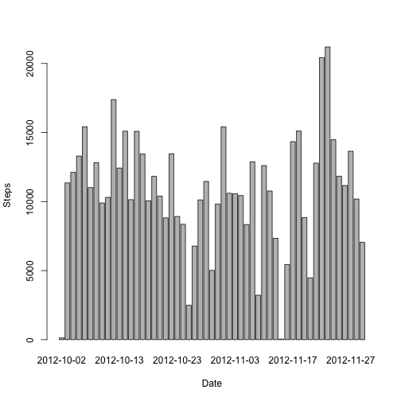
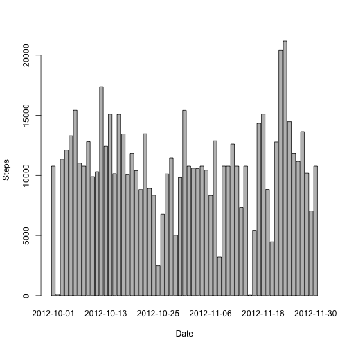

# Reproducible Research: Peer Assessment 1


## Loading and preprocessing the data

We can start to open the csv file, convert it to a data.frame and preprocess the data in order to have a tidy and useful dataset.

```r
# open the dataset
table <- read.csv("./activity.csv")
# convertions
table$date <- as.Date(table$date)
table$steps <- as.numeric(as.character(table$steps))
table$interval <- as.numeric(as.character(table$interval))
head(table)
```

```
##   steps       date interval
## 1    NA 2012-10-01        0
## 2    NA 2012-10-01        5
## 3    NA 2012-10-01       10
## 4    NA 2012-10-01       15
## 5    NA 2012-10-01       20
## 6    NA 2012-10-01       25
```

```r
# preprocessing
steps_date <- aggregate(steps ~ date, data = table, FUN = sum)
```

We now have a tidy and simple dataset to analize:

```r
str(steps_date)
```

```
## 'data.frame':	53 obs. of  2 variables:
##  $ date : Date, format: "2012-10-02" "2012-10-03" ...
##  $ steps: num  126 11352 12116 13294 15420 ...
```

```r
head(steps_date)
```

```
##         date steps
## 1 2012-10-02   126
## 2 2012-10-03 11352
## 3 2012-10-04 12116
## 4 2012-10-05 13294
## 5 2012-10-06 15420
## 6 2012-10-07 11015
```


## What is mean total number of steps taken per day?
We can now create a histogram that plot the steps per day.

```r
barplot(steps_date$steps, names.arg = steps_date$date, xlab = "Date", ylab = "Steps")
```

 

We can proceed calculating the mean of the steps:

```r
steps_mean <- mean(steps_date$steps)
steps_mean
```

```
## [1] 10766
```

And the median of the steps:

```r
steps_median <- median(steps_date$steps)
steps_median
```

```
## [1] 10765
```


## What is the average daily table pattern?

Now let's make a time series plot (i.e. type = "l") of the 5-minute interval (x-axis) and the average number of steps taken, averaged across all days (y-axis)


```r
steps_data <- aggregate(steps ~ interval, data = table, FUN = mean)
plot(steps_data, type = "l", xlab = "Interval", ylab = "Steps")
```

 


Which 5-minute interval, on average across all the days in the dataset,
contains the maximum number of steps?


```r
steps_data$interval[which.max(steps_data$steps)]
```

```
## [1] 835
```


## Imputing missing values
Note that there are a number of days/intervals where there are missing values (coded as NA). The presence of missing days may introduce bias into some calculations or summaries of the data.

Calculate and report the total number of missing values in the dataset


```r
sum(is.na(table))
```

```
## [1] 2304
```


Creation of a dataset with the *mean* filled instead of the missing values


```r
table <- merge(table, steps_data, by = "interval", suffixes = c("", ".y"))
na <- is.na(table$steps)
table$steps[na] <- table$steps.y[na]
table <- table[, c(1:3)]
```


Let's make a histogram of the total number of steps taken each day and Calculate
and report the **mean** and **median** total number of steps taken per day.


```r
steps_date <- aggregate(steps ~ date, data = table, FUN = sum)
barplot(steps_date$steps, names.arg = steps_date$date, xlab = "Date", ylab = "Steps")
```

 

```r
mean(steps_date$steps)
```

```
## [1] 10766
```

```r
median(steps_date$steps)
```

```
## [1] 10766
```

We can see that median and mean are now corresponding instead the analysis with *Na values*

## Are there differences in table patterns between weekdays and weekends?

Create a new factor variable in the dataset with two levels -- "weekday" and
"weekend" indicating whether a given date is a weekday or weekend day.


```r
Sys.setlocale("LC_TIME", "en_US")
```

```
## [1] "en_US"
```

```r
dayOfWeek <- function(date) {
    if (weekdays(as.Date(date)) %in% c("Saturday", "Sunday")) {
        "weekend"
    } else {
        "weekday"
    }
}
table$dayOfWeek <- as.factor(sapply(table$date, dayOfWeek))
head(table)
```

```
##   interval steps       date dayOfWeek
## 1        0 1.717 2012-10-01   weekday
## 2        0 0.000 2012-11-23   weekday
## 3        0 0.000 2012-10-28   weekend
## 4        0 0.000 2012-11-06   weekday
## 5        0 0.000 2012-11-24   weekend
## 6        0 0.000 2012-11-15   weekday
```


Make a panel plot containing a time series plot of the 5-minute interval (x-axis)
and the average number of steps taken, averaged across all weekday days or
weekend days (y-axis).


```r
par(mfrow = c(2, 1))
steps_type <- aggregate(steps ~ interval, data = table, subset = table$dayOfWeek == 
    "weekend", FUN = mean)
plot(steps_type, main = "weekend", type = "l", xlab = "Interval", ylab = "Steps")
steps_type <- aggregate(steps ~ interval, data = table, subset = table$dayOfWeek == 
    "weekday", FUN = mean)
plot(steps_type, main = "weekday", type = "l", xlab = "Interval", ylab = "Steps")
```

 

